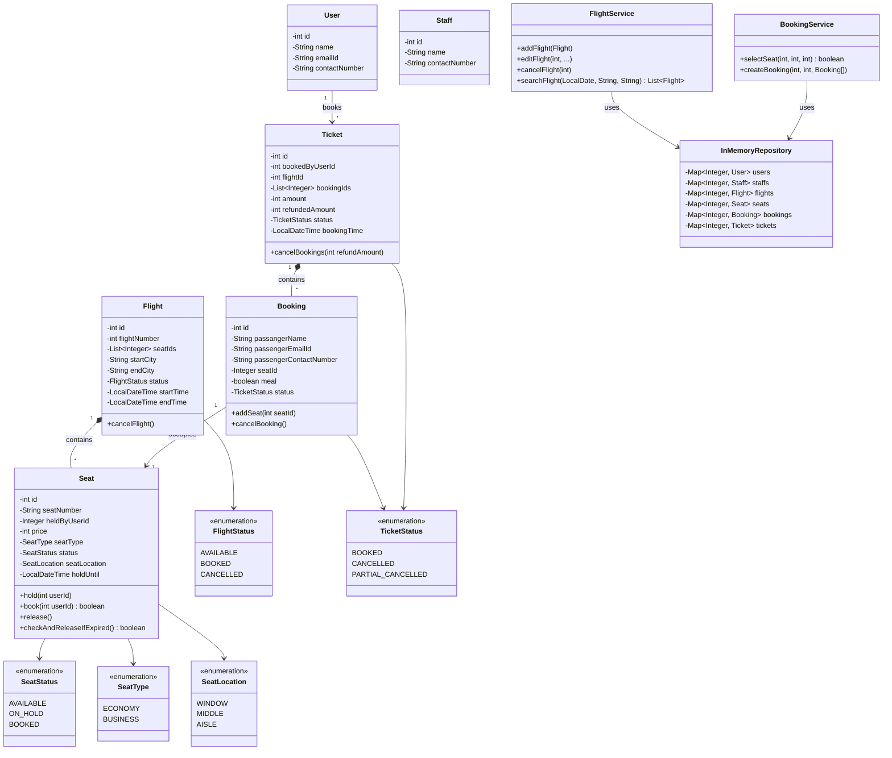

# Airline Ticket Management System Low Level Design

## Problem Statement
Design a Low Level Design for an Airline Ticket Management System that lets users search flights, hold and book seats, and cancel bookings, while staff manage the flight inventory. The system must keep seat holds temporary and consistent so two users can never end up owning the same seat.

## Requirements
*   **Search Flights**: Search available flights by source city, destination city, and date.
*   **Seat Selection**: View seats by class (Economy/Business) and location (Window/Middle/Aisle), and place a temporary hold on a seat.
*   **Booking**: Convert held seats into a confirmed booking and generate a ticket covering one or more passengers.
*   **Cancellation**: Cancel individual bookings within a ticket (partial cancellation) or the entire ticket, and release/refund accordingly.
*   **Seat Hold Expiry**: A selected seat is held for **5 minutes**; if payment is not completed within the window the hold expires and the seat becomes available again. A failed payment can be retried while the hold is still valid.
*   **Flight Management (Staff)**: Add, edit, and cancel flights. Cancelling a flight releases all its seats and cancels/refunds every ticket booked on it.

### Non-Functional Requirements
*   **Consistency**: No two users should be able to hold or book the same seat at the same time.
*   **Low Latency**: Seat search and hold operations should respond quickly, especially under concurrent booking attempts.

---

## Core Entities & Responsibilities

### 1. User
Represents a customer using the system.
*   **Responsibilities**:
    *   Holds identity/contact details used to search flights and initiate bookings.

### 2. Staff
Represents an airline employee who manages flight inventory.
*   **Responsibilities**:
    *   Adds, edits, and cancels flights.

### 3. Flight
Represents a single scheduled flight between two cities.
*   **Responsibilities**:
    *   Tracks its route, schedule, status, and the seats that belong to it.
    *   Transitions to `CANCELLED` when withdrawn by staff.

### 4. Seat
Represents a single seat on a flight.
*   **Responsibilities**:
    *   Tracks type, location, price, and status (`AVAILABLE`/`ON_HOLD`/`BOOKED`).
    *   Owns the hold lifecycle: `hold()`, `book()`, `release()`, and `checkAndReleaseIfExpired()` for the 5-minute expiry.

### 5. Booking
Represents one passenger's reservation on a specific seat, within a ticket.
*   **Responsibilities**:
    *   Stores passenger details, the seat assigned, and its own status.
    *   Exposes `cancelBooking()` so a single passenger's booking can be marked cancelled independently of the rest of the ticket — currently only exercised via full flight cancellation, not a standalone endpoint.

### 6. Ticket
Represents the overall purchase made by a user for a flight, grouping one or more bookings.
*   **Responsibilities**:
    *   Tracks total amount paid, amount refunded, and overall status.
    *   Rolls up to `PARTIAL_CANCELLED` or `CANCELLED` as individual bookings are cancelled.

### 7. FlightService
Orchestrates flight inventory management.
*   **Responsibilities**:
    *   Add, edit, cancel, and search flights.
    *   On cancellation, releases all seats and cancels every ticket tied to that flight.

### 8. BookingService
Orchestrates the seat-hold-to-booking flow.
*   **Responsibilities**:
    *   Places a temporary hold on a seat, validating flight/seat/user existence and hold expiry.
    *   Confirms bookings by validating all held seats before booking any of them, then creates the ticket.
    *   Does **not** yet expose a cancellation method — see [Cancellation Flow](#2-cancellation-flow).

### 9. InMemoryRepository
Acts as the in-memory data store.
*   **Responsibilities**:
    *   Maintains maps of users, staff, flights, seats, bookings, and tickets.

---

## Class Diagram

---

## Key Processes

### 1. Seat Hold and Booking Flow
1.  **Select Seat**: `BookingService.selectSeat()` validates the flight, seat, and user exist and that the seat belongs to the flight.
    *   If the seat is `ON_HOLD` but its `holdUntil` has passed, the expired hold is released first.
    *   If the seat is `AVAILABLE`, it is placed `ON_HOLD` for the calling user with a 5-minute `holdUntil`.
2.  **Confirm Booking**: `BookingService.createBooking()` first validates **every** seat in the passenger list is still held by the same user and not expired, before booking any of them — this avoids partially booking a group when one seat's hold has lapsed.
3.  **Ticket Creation**: Once all seats are booked, a single `Ticket` is created covering all the passenger `Booking`s, with the total amount summed from each seat's price.
4.  **Retry on Failure**: Because the hold is time-based rather than single-use, a failed payment can call `createBooking()` again as long as `holdUntil` has not passed.

### 2. Cancellation Flow
*   **Flight Cancellation** (`FlightService.cancelFlight`, implemented): Marks the flight `CANCELLED`, releases every seat on it back to `AVAILABLE`, and for every ticket booked on that flight, cancels **all** of its bookings and calls `Ticket.cancelBookings(ticket.getAmount())` — a full refund, since the whole ticket is voided.
*   **Partial Booking Cancellation** (model-supported, not yet wired to a service method): `Ticket.cancelBookings(refundAmount)` is written to support incremental refunds — the status only flips to `CANCELLED` once `refundedAmount >= amount`, otherwise it becomes `PARTIAL_CANCELLED`. `Booking.cancelBooking()` can mark a single passenger's booking cancelled independently. Today nothing in `BookingService` calls these for a user-initiated "cancel one booking out of a ticket" request — the `PATCH /ticket/{ticketId}` endpoint in the API design below is the intended contract for this, but the corresponding service method is not yet implemented.

---

## API Design

**Search flights by date, source, and destination**
*   `GET /flights/search`
*   Request: `{date, source, destination}`
*   Response: `[{flightDetails}, ...]`

**Staff adds a flight**
*   `POST /flight/add`
*   Request: `{flightDetails}`
*   Response: `{flightDetails}`

**Staff edits an existing flight**
*   `PUT /flight/{flightId}`
*   Request: `{flightDetails}`
*   Response: `{flightDetails}`

**Staff cancels a flight**
*   `PATCH /flight/{flightId}`
*   Request: `{status: "CANCELLED"}`
*   Response: `{flightDetails}`

**User selects a seat for a flight**
*   `PATCH /flight/{flightId}/seat`
*   Request: `{userId, seatIds: []}`
*   Response: `{"success": true}`

**User completes the booking and a ticket is created**
*   `POST /flight/{flightId}/ticket`
*   Request: `{userId, bookingIds: []}`
*   Response: `{ticketId}`

**Ticket cancellation**
*   `PATCH /ticket/{ticketId}`
*   Request: `{userId, status: "CANCEL", bookingIds: []}`
*   Response: `{"success": true}`

---

## Potential Extensions
*   **Payment Gateway Integration**: Model a real payment attempt/retry lifecycle instead of assuming success on `createBooking()`.
*   **Dynamic Pricing**: Vary seat price based on demand, remaining inventory, or time to departure.
*   **Distributed Locking**: Replace in-memory hold checks with a distributed lock/TTL cache (e.g. Redis) so the hold guarantee holds across multiple service instances.
*   **Multi-leg/Connecting Flights**: Support itineraries composed of multiple flight segments under one ticket.
