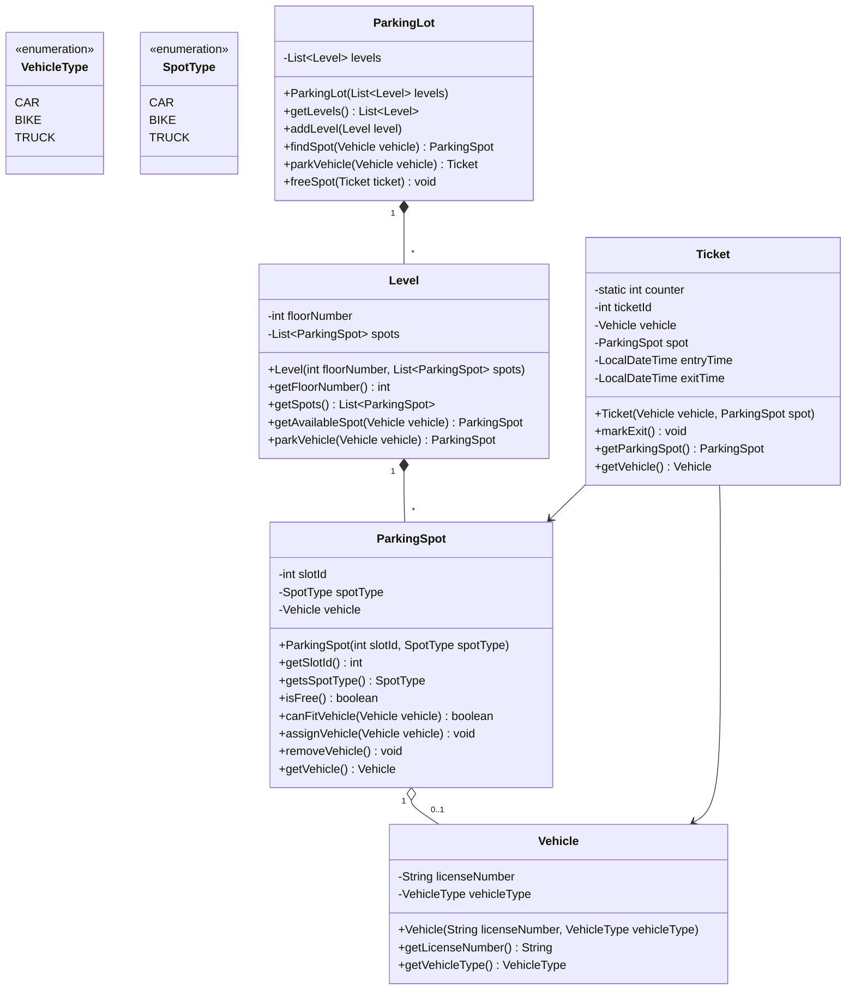

# Low Level Design: Parking Lot

## 1. Problem Statement
Design a multi-level parking lot system that can accommodate different types of vehicles (Cars, Bikes, Trucks). The system should assign a parking spot to a vehicle upon entry and free up the spot upon exit, providing a ticket for the user.

## 2. Requirements
*   **Multi-level**: The parking lot should have multiple levels/floors.
*   **Multiple Vehicle Types**: Support for Car, Bike, and Truck.
*   **Capacity**: Each level has a fixed number of spots for each vehicle type.
*   **Entry**: Assigns the nearest available spot (or uses a strategy) and issues a ticket.
*   **Exit**: Validates the ticket, frees the spot, and handles the vehicle removal.

## 3. Class Diagram

## 4. Entity Descriptions

Based on the actual implementation, here is the detailed breakdown of the core entities and their responsibilities:

### 1. Vehicle
**Responsibility**: Represents the physical vehicle entering the parking lot.
*   **Fields**:
    *   `licenseNumber`: `String` - Unique identifier for the vehicle.
    *   `vehicleType`: `VehicleType` - Enum {CAR, BIKE, TRUCK}.

### 2. ParkingLot
**Responsibility**: The controller class that manages the entire parking system.
*   **Fields**:
    *   `levels`: `List<Level>` - A list of all floors in the parking lot.
*   **Constructor**:
    *   `ParkingLot(List<Level> levels)`: Initializes the parking lot with existing levels.
*   **Core Methods**:
    *   `addLevel(Level level)`: Adds a new floor to the system.
    *   `parkVehicle(Vehicle vehicle)`: Coordinates finding a spot, assigning it, and generating a Ticket.
    *   `freeSpot(Ticket ticket)`: Coordinates unparking/releasing a spot given a ticket.
    *   `findSpot(Vehicle vehicle)`: Search algorithm to find the available spot.

### 3. Level
**Responsibility**: Manages parking spots for a single floor.
*   **Fields**:
    *   `floorNumber`: `int` - Identifier for the floor (e.g., 1, 2, 3).
    *   `spots`: `List<ParkingSpot>` - Collection of all spots on this floor.
*   **Constructor**:
    *   `Level(int floorNumber, List<ParkingSpot> spots)`: Initializes a level with specific spots.
*   **Core Methods**:
    *   `getAvailableSpot(Vehicle vehicle)`: Finds a free spot suitable for the vehicle type.
    *   `parkVehicle(Vehicle vehicle)`: Attempts to park a vehicle on a spot on this floor.

### 4. ParkingSpot
**Responsibility**: Represents an individual atomic parking space.
*   **Fields**:
    *   `slotId`: `int` - Unique ID for the spot (e.g., 1, 2).
    *   `spotType`: `SpotType` - The type of vehicle this spot is designed for.
    *   `vehicle`: `Vehicle` - Reference to the vehicle currently parked (null if free).
*   **Constructor**:
    *   `ParkingSpot(int slotId, SpotType spotType)`: Initializes a spot.
*   **Core Methods**:
    *   `isFree()`: Checks if the spot is unoccupied (`vehicle == null`).
    *   `canFitVehicle(Vehicle vehicle)`: Validation logic to check if vehicle type matches spot type.
    *   `assignVehicle(Vehicle vehicle)`: Assigns the vehicle to the spot. Throws exception if occupied.
    *   `removeVehicle()`: Removes the vehicle, freeing the spot.
    *   `getsSpotType()`: Returns the type of the spot.

### 5. Ticket
**Responsibility**: Proof of entry and parking assignment.
*   **Fields**:
    *   `ticketId`: `int` - Unique incremental receipt ID.
    *   `vehicle`: `Vehicle` - The car/bike associated with this ticket.
    *   `spot`: `ParkingSpot` - The assigned location.
    *   `entryTime`: `LocalDateTime` - Timestamp of entry.
    *   `exitTime`: `LocalDateTime` - Timestamp of exit.
*   **Core Methods**:
    *   `markExit()`: Sets the `exitTime` to current time.

## 5. Potential Extensions
*   **PaymentIntegration**: Add `Payment` class and `calculateFee()` logic based on duration between `entryTime` and `exitTime`.
*   **ExitGate / EntryGate**: Physical checkpoints that handle the `parkVehicle` and `freeSpot` triggers.
*   **ParkingStrategies**: Strategy Pattern to handle different parking logic (e.g., `NearestToElevator`, `FillFirstLevelFirst`).
