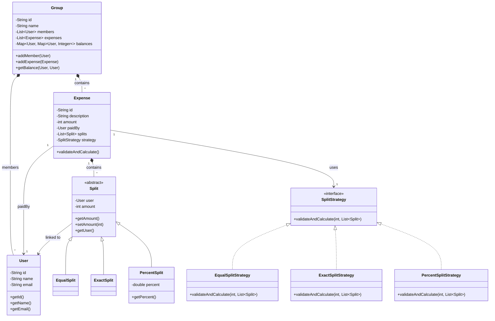

# Low Level Design: Splitwise

## 1. Problem Statement
Design a simplified Splitwise system that allows users to create groups, add expenses, and settle balances. The system should support different ways to split expenses (Equal, Exact, Percentage) and ensure data consistency.

**Entity**

User
- String id
- String name
- String email
+ getters

Group
- String id
- String name
- List<User> members
- List<Expense> expenses
- Map<User, Map<User, Integer>> balances
+ void addMember(User user)
+ void addExpense(Expense expense)
+ int getBalance(User u1, User u2)
+ Map<User, Integer> getBalancesForUser(User user)

Expense
- String id
- String description
- int amount
- User paidBy
- List<Split> splits
- SplitStrategy strategy
+ void validateAndCalculate()
+ getters

abstract class Split
- User user
- int amount

EqualSplit extends Split
(no extra fields)

ExactSplit extends Split
(no extra fields)

PercentSplit extends Split
- double percent

interface SplitStrategy
+ void validateAndCalculate(int totalAmount, List<Split> splits)

EqualSplitStrategy implements SplitStrategy
+ void validateAndCalculate(int totalAmount, List<Split> splits)

ExactSplitStrategy implements SplitStrategy
+ void validateAndCalculate(int totalAmount, List<Split> splits)

PercentSplitStrategy implements SplitStrategy
+ void validateAndCalculate(int totalAmount, List<Split> splits)

SplitwiseService
- Map<String, User> users
- Map<String, Group> groups
+ addUser()
+ createGroup()
+ addExpense()
+ settleBalance()

**Class Diagram**

## 4. Entity Descriptions

Based on the actual implementation, here is the detailed breakdown of the core entities and their responsibilities:

### 1. User
**Responsibility**: Represents a registered user in the system.
*   **Fields**:
    *   `id`: `String` - Unique identifier for the user.
    *   `name`: `String` - Display name of the user.
    *   `email`: `String` - Contact email.
*   **Constructor**:
    *   `User(String id, String name, String email)`: Initializes a new user.

### 2. Group
**Responsibility**: manages a collection of users and their shared expenses.
*   **Fields**:
    *   `id`: `String` - Unique group identifier.
    *   `name`: `String` - Name of the group.
    *   `members`: `List<User>` - Users belonging to this group.
    *   `expenses`: `List<Expense>` - History of expenses recorded in this group.
    *   `balances`: `Map<User, Map<User, Integer>>` - Adjacency matrix-like structure storing net balances between each pair of users. `balances.get(A).get(B)` represents how much A owes B (or vice versa depending on implementation sign convention).
*   **Constructor**:
    *   `Group(String id, String name, List<User> members)`: Creates a group with initial members.
*   **Core Methods**:
    *   `addMember(User user)`: Adds a new user to the group.
    *   `addExpense(Expense expense)`: Adds an expense, triggers validation, and updates the balance map.
    *   `getBalance(User u1, User u2)`: Returns the net balance between two users.

### 3. Expense
**Responsibility**: Represents a single transaction or expenditure.
*   **Fields**:
    *   `id`: `String` - Unique expense ID.
    *   `description`: `String` - Short description (e.g., "Dinner").
    *   `amount`: `int` - Total cost.
    *   `paidBy`: `User` - The user who originally paid the total amount.
    *   `splits`: `List<Split>` - List defining how the amount is divided among beneficiaries.
    *   `strategy`: `SplitStrategy` - The strategy used to validate and calculate the splits.
*   **Constructor**:
    *   `Expense(String id, String description, int amount, User paidBy, List<Split> splits, SplitStrategy strategy)`
*   **Core Methods**:
    *   `validateAndCalculate()`: Delegates to the `strategy` to validate the splits and calculate individual amounts if needed.

### 4. Split and Subclasses
**Responsibility**: Defines the share of an expense for a specific user.
*   **Split (Abstract)**: Base class containing `User` and `amount`.
*   **EqualSplit**: Represents a split where everyone pays equally.
*   **ExactSplit**: Represents a split where the specific amount is manually defined.
*   **PercentSplit**: Represents a split defined by a percentage of the total.

### 5. SplitStrategy (Interface)
**Responsibility**: Encapsulates the logic for validating and calculating split amounts.
*   **Interface Method**:
    *   `validateAndCalculate(int totalAmount, List<Split> splits)`: Validates that splits sum up to the total (or 100%) and sets the `amount` field for each split.
*   **Implementations**:
    *   `EqualSplitStrategy`: Divides total amount by number of splits. Handles remainder by adding it to the first split.
    *   `ExactSplitStrategy`: Validates that sum of split amounts equals total amount.
    *   `PercentSplitStrategy`: Calculates amounts based on percentages. Validates total percent is 100%.

### 6. SplitwiseService (Implicit/Planned)
**Responsibility**: Controller/Service layer to orchestrate operations (often a Singleton).
*   **Fields**:
    *   `users`: `Map<String, User>` - Repository of all users.
    *   `groups`: `Map<String, Group>` - Repository of all groups.

## 5. Potential Extensions
*   **Simplify Debt**: Implement a graph algorithm (like Min-Cash Flow) to reduce the number of transactions needed to settle up within a group.
*   **Activity Log**: Record every action (expense added, group created) for audit trails.
*   **Multi-Currency**: Support expenses in different currencies and handle conversion rates.
*   **Expense Categories**: Tag expenses (Food, Travel, Rent) for analytics.
