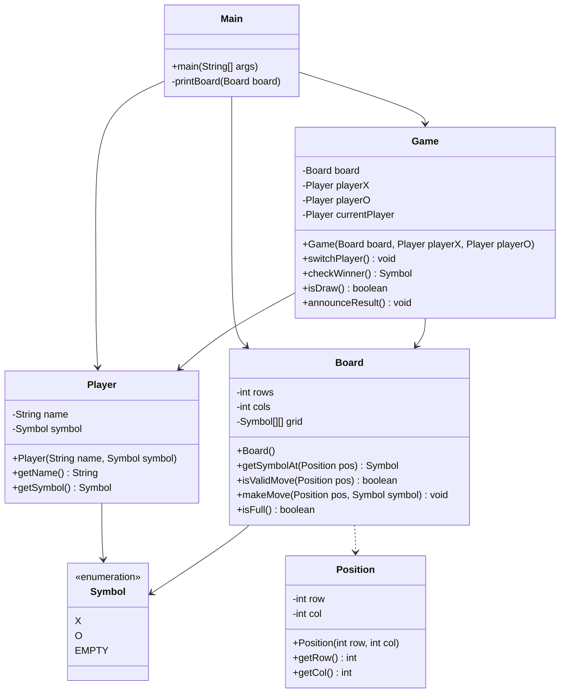

# Low Level Design: Tic-Tac-Toe

## 1. Problem Statement
Design a console-based Tic-Tac-Toe game where two players (X and O) take turns marking spaces in a 3x3 grid. The player who succeeds in placing three of their marks in a horizontal, vertical, or diagonal row wins the game. If the grid is filled without a winner, the game ends in a draw.

## 2. Requirements
*   **Grid**: A 3x3 game board.
*   **Players**: Two players, one using symbol 'X' and the other 'O'.
*   **Turns**: Players take turns to place their symbol on an empty spot.
*   **Validation**: moves must be within grid bounds and on empty spots.
*   **Win Condition**: Three same symbols in a row, column, or diagonal.
*   **Draw Condition**: All spots filled with no winner.
*   **Game Loop**: The game continues until there is a winner or a draw.

## 3. Class Diagram

## 4. Entity Descriptions

### 1. Symbol (Enum)
Represents the possible states of a cell on the board: `X`, `O`, or `EMPTY`.

### 2. Position
Immutable class representing a coordinate `(row, col)` on the board.
*   Used to pass coordinates safely between layers.

### 3. Player
Represents a participant in the game.
*   **Fields**: `name` (e.g., "Player X"), `symbol` (X or O).

### 4. Board
Manages the grid state.
*   **Responsibility**: Validating moves, applying moves, checking if the board is full.
*   **Key Methods**:
    *   `makeMove(Position, Symbol)`: Updates the grid if the move is valid.
    *   `isValidMove(Position)`: Checks bounds and vacancy.
    *   `isFull()`: Checks if all cells are occupied (used for draw condition).

### 5. Game
Encapsulates the game logic and rules.
*   **Responsibility**: Managing turns, checking win/draw conditions.
*   **Key Methods**:
    *   `checkWinner()`: Checks rows, columns, and diagonals for a win. Returns the winning `Symbol` or `EMPTY`.
    *   `isDraw()`: Returns true if board is full and no winner.
    *   `switchPlayer()`: Toggles `currentPlayer`.

### 6. Main
Entry point of the application.
*   **Responsibility**: Handles user input (Scanner), game loop, and rendering the board to the console.